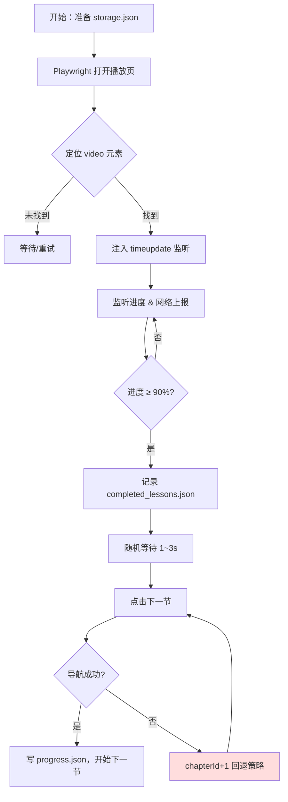

# ✈️ CxPilot

> **Automated Chaoxing lecture pilot** — auto-plays recorded courses and advances chapters hands-free.

---

## 功能特性

- 🎬 **自动播放**：基于 Playwright，在真实浏览器中打开录播课页面并注入进度监听器
- 📊 **进度检测**：监听 `timeupdate` 事件，当视频播放进度 ≥ 90% 时自动触发下一节
- ⏭️ **章节跳转**：优先点击页面内"下一节"按钮，失败时自动回退至 `chapterId+1` 策略
- 🔒 **进程锁**：`runner.lock` 机制防止多实例并发打开浏览器
- 📝 **完整日志**：请求抓包（`captured_requests.json`）、章节记录（`completed_lessons.json`）、运行日志（`run.log`）
- 🛡️ **弹窗处理**：自动 accept JS dialog，并周期性点击"确定/确认/跳过"类 DOM 弹窗

---

## 快速开始

### 前提

- Node.js ≥ 18
- pnpm（或 npm）

### 安装

```bash
pnpm install
pnpm exec playwright install chromium
```

### 登录态准备

首次使用需手动登录一次并导出 `storage.json`：

```bash
npx playwright open --save-storage=storage.json https://mooc1.chaoxing.com
```

在打开的浏览器中完成登录，关闭窗口后 `storage.json` 即生成。

> ⚠️ **不要将 `storage.json` 提交到版本库！** 它包含你的登录凭据。

### 运行

```bash
# 传入 chapterId（纯数字）或完整播放页 URL
node run_loop.js 1172050672

# 或使用 npm 脚本
pnpm start 1172050672
```

---

## 项目结构

```
CxPilot/
├── capture_play_requests_entry.js  # 主脚本：自动化播放 & 进度检测
├── capture_play_requests.js        # 早期探测脚本（一次性抓包）
├── run_loop.js                     # 启动器（单次运行模式）
├── analyze_enc.js                  # 签名/enc 分析工具
├── analyze_capture.js              # 抓包分析工具
├── inspect_next_button.js          # 下一节按钮检测工具
├── lib/
│   ├── lock.js                     # 进程锁模块
│   └── logger.js                   # 日志模块
├── storage.json                    # 登录态（⚠️ 勿提交）
├── captured_requests.json          # 抓包与事件日志（运行时追加）
├── completed_lessons.json          # 已完成章节列表
└── run.log                         # 运行日志
```

---

## 工作原理



---

## 调试

遇到多浏览器实例或崩溃时：

```powershell
# 强制终止所有 node 进程
Get-Process -Name node | Stop-Process -Force

# 手动清理锁文件
Remove-Item runner.lock -ErrorAction SilentlyContinue
```

---

## 已知问题

| 问题 | 状态 |
|---|---|
| Target page closed 导致崩溃 | 🔧 修复中 |
| 章节 ID 非线性跳号 | 📋 待实现章节列表 API 解析 |
| enc 签名来源未明确 | 🔍 分析中（见 `analyze_enc.js`） |

---

## License

MIT
