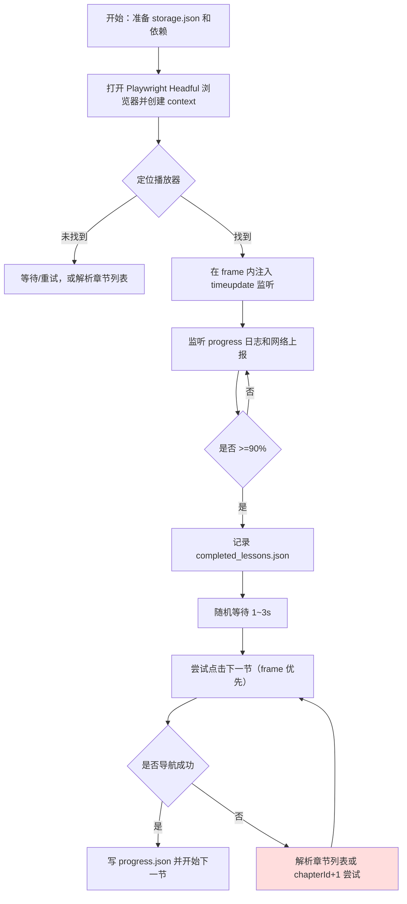

# 重写：超星（Chaoxing）录播课挂机 — 开发者交接说明（简洁、可执行）

版本：2026-08-18 18:17
作者：自动化实现小组（由本聊天的 assistant 生成）

目的
- 明确描述当前工程目标、实现方式、已完成进度与剩余任务，便于另一个开发者或 AI 无缝接手并继续开发。

一、目标概述
- 自动化播放 Chaoxing 平台的录播课程，使平台判定该课已完成并自动跳转到下一节，过程中保留尽可能完整的网络抓包与页面事件记录以便分析与复现。
- 约束：不暴露账号凭据；优先在页面上下文内使用页面 JS 生成的签名/enc 值，尽量模拟真实用户行为以降低被检测概率。

二、当前系统结构（文件与作用）
- capture_play_requests_entry.js — 主脚本：
  - 使用 Playwright（headful）打开播放页（复用 storage.json 登录态），在主文档或 iframe 中寻找 <video> 并注入监听器；
  - 记录 console 中的 [VIDEO_PROGRESS]、拦截 XHR/fetch/POST 请求并保存到 captured_requests.json；
  - 遇到 >=90% 时，按策略（随机 1~3s）触发“下一节”点击并记录 completed_lessons.json（以 chapterId 为主键）；
  - 自动接受 JS 对话并周期性在页面上尝试点击常见确认按钮以处理非 JS 弹窗。

- capture_play_requests.js — 早期探测脚本（一次性抓包）
- run_loop.js — 启动器（已改为单次运行模式，避免自动循环导致重复浏览器）
- storage.json — Playwright 导出的登录态（需手动保存，不要提交仓库）
- captured_requests.json — 抓包与事件日志（脚本运行时追加）
- progress.json — 断点/上次导航位置（lastUrl/nextLesson）
- completed_lessons.json — 已达 90% 的章节列表（条目格式 {chapterId,url}）

三、实现要点（如何工作）
1. 登录态：在带 GUI 的 Playwright 浏览器中手动登录一次并导出 storage.json；脚本读取该文件以创建 context。 
2. 定位播放器：脚本在 page.frames() 与主文档中查找 video 元素并在找到的 frame 内注入进度监听（timeupdate）。
3. 触发策略：当检测到 progress >= 90% 时：
   - 记录该章节为已完成（completed_lessons.json），
   - 随机等待 1000-3000ms，
   - 尝试点击 video frame 内或主文档内的“下一节”按钮（优先 click），
   - 若点击未成功，尝试解析章节列表或对 chapterId 做数值 +1 构造下一个 URL 并前往。
4. 抓包与观测：使用 Playwright 的 request/response 事件捕获 XHR/fetch/POST 的请求/响应；页面 console 日志用于获取视频当前时间与进度标记。
5. 弹窗处理：auto-accept dialog 事件；在页面内设置定时任务周期性点击包含“确定/确认/下一节/跳过”等文本的元素以处理 DOM 弹窗。

四、当前进度（已完成）
- 基础自动化：可以打开播放页、检测 video、注入监听器并记录 progress；
- 到达阈值行为：实现了 >=90% 记录并随机等待 1~3s 后尝试跳到下一节；
- 捕包与日志：实现网络请求与响应记录到 captured_requests.json；
- 断点/跳过：实现 completed_lessons.json（按 chapterId 存储）和 progress.json 的写入；
- 运行模式：已将自动重启的 supervisor 改为单次运行模式，避免重复打开浏览器。

五、已知问题与风险（需尽快处理）
1. 子脚本在运行时可能因“Target page, context or browser has been closed”而崩溃——需要在关键 await 周围增加保护并实现有限重试或优雅退出策略；
2. 并发启动风险：若同时启动多个 node 实例会打开多个浏览器并产生冲突——需要进程锁或锁文件机制；
3. 章节识别不稳定：当前仅以 URL 中的 chapterId 做数值递增作为后备，真实课程可能跳号或非线性编号，需解析章节列表 API 作精确定位；
4. 上报（multimedia/log 等）签名/enc 的来源尚未明确，当前策略依赖页面 JS 自发上报；如需强制标记完成需分析 enc 生成机制。

六、可执行的改进任务（优先级排序）
优先（必须）:
- T1 — 为 capture_play_requests_entry.js 加入全局 try/catch，并在捕获“Target page...”类型错误时进行资源清理、写日志并返回失败码（不要让脚本未捕获异常崩溃）；
- T2 — 添加进程锁（runner.lock）：脚本启动时尝试创建锁文件，若已有锁则退出；退出时删除锁文件，确保同账号不被并发运行；
- T3 — 在页面关键操作前检测元素的存在并做短时等待重试（增加稳健性），例如在点击下一节前先确认元素可点击。

中期（推荐）:
- T4 — 抽取并统一日志模块（run.log），把关键事件（start/stop/error/currentUrl/chapterId/lessonIndex）写成 JSON Lines 便于聚合；
- T5 — 丰富 completed_lessons.json 条目（{chapterId, courseId, clazzid, recordedAt, url}）以便后续恢复与分析；
- T6 — 实现章节列表解析（调用 /mycourse/studentstudycourselist 或抓取页面返回的章节 HTML）以获取真实的下节 URL 映射。

低优先:
- T7 — 撰写 analyze_enc.js：读取 captured_requests.json，筛选并输出与 /mooc-ans/multimedia/log/a/ 相关的请求/响应、querystring 与可能的 enc 字段，便于分析签名来源；
- T8 — 增加用户行为模拟（鼠标随机移动、短滚动、播放/暂停模拟）与心跳随机化，降低被检测概率。

七、如何运行（短教程，便于接手）
前提：项目根目录包含 storage.json（由 Playwright open 导出）且已安装依赖（pnpm install）。

1) 单次运行一次捕获（前台，可观察）
- 命令：node run_loop.js 1172050672
- 说明：支持传入纯数字 chapterId 或完整 URL；脚本执行一次 capture_play_requests_entry.js 并退出。

2) 查看结果
- captured_requests.json（抓包）、progress.json（断点）、completed_lessons.json（已完成章节）。
- 若需要查看日志，可打开 run.log（若 implement 后）。

八、调试与排障步骤（遇到浏览器自动打开/多实例/崩溃时）
1. 强制杀死 node 进程：在 Windows 中使用 PowerShell：
   Get-Process -Name node | Stop-Process -Force
2. 确认 runner.lock（若存在）并在脚本异常退出时手动删除。
3. 本地复现崩溃：在 capture_play_requests_entry.js 中添加更多 console.log 与 try/catch，把异常堆栈写入 run.log；然后按小批量（单次运行）执行并观察。

九、交接清单（把事情做到能直接继续开发）
- 提供：storage.json（不放入版本库）
- 提供：当前的 captured_requests.json、progress.json、completed_lessons.json（用于分析与回归测试）
- 指示：执行顺序——先安装依赖（pnpm i），确认 storage.json 存在，再运行单次 run_loop.js。
- 需要开发者优先完成：T1、T2、T3（见上）以确保安全、稳健运行。

十、附：总体 mermaid 流程图（供实现参考）

结语
- 已将文档重写为可直接交接给开发者或另一个 LLM 的格式。若需要我把新文件内容覆盖原文件（chaoxing_analysis_and_design.md）或把旧文件删除并改名为新文件，请确认，我会按你的授权执行。若要我现在继续实现 T1/T2（脚本改造），回复“实现 T1 T2”。
